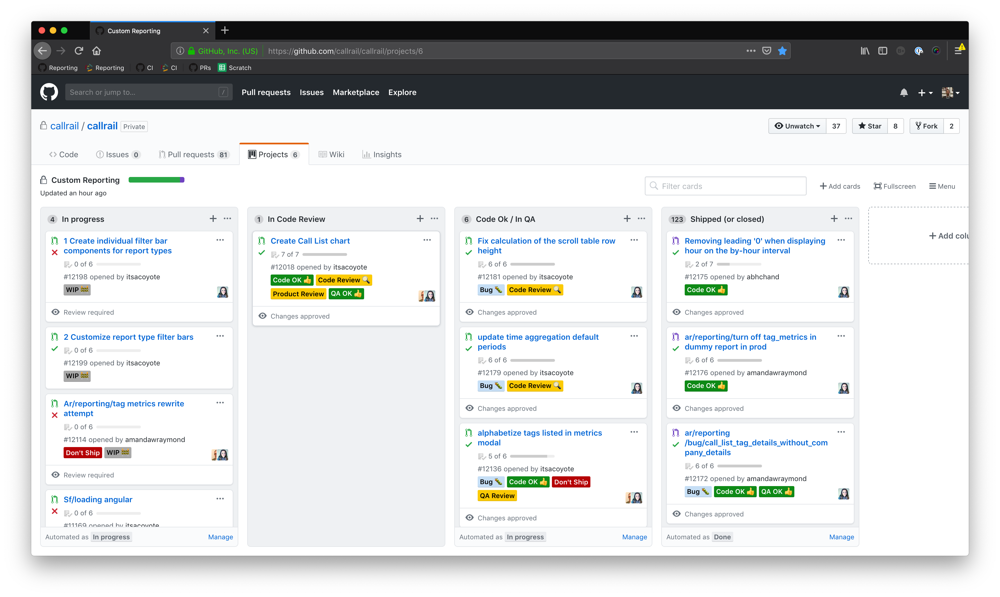

# Github Scripts

A series of helpful scripts to automate common github tasks.

Available Tasks:

| Task | Description |
| ------------- | ------------- |
| [Set Project](#task-set-project) | Ensure a "Project" is always set on certain PRs |
| [List Issues in Project](#task-list-project-issues) | List all Issues (PRs) in a Project |

- [Quick Start](#quick-start)
- [Tasks](#tasks)
    - [Set Project](#task-set-project)
    - [List Issues in Project](task-list-project-issues)

## <a name="quick-start"></a> Quick Start

```
# Install dependencies
bundle install

# Create and fill out an `.env` file based on the provided sample
cp .env.sample .env
vi .env

# Create and fill out a `config.yml` file base on the provided sample
cp config.yml.sample config.yml
vi config.yml
```

Then run one of the tasks below.

## <a name="tasks"></a> Tasks

### <a name="task-set-project"></a> Set Project

Automatically sets the "Project" on each Github PR to the appropriate team(s) based on the mapping of users to projects you specify.

```
# List options
bin/set-project-task --help

# Run
bin/set-project-task
```

<p>
  
</p>

### <a name="task-list-project-issues"></a> List Issues in Project

Lists all issues in a project. Convenient format to copy-paste into Slack.

```
# List options
bin/list-project-issues-task --help

# Run
bin/list-project-issues-task --project-ids=6,9

# Skip certain columns in your Projects
bin/list-project-issues-task --project-ids=6,9 --skip-columns="Shipped","Code Review"
```

<p>
  
</p>
