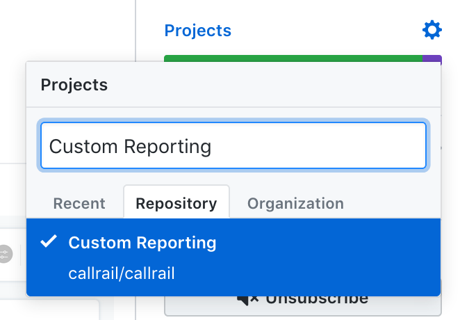

# Github Scripts

A series of helpful scripts to automate common github tasks

# Set Project Task

Automatically sets the "Project" on each Github PR to the appropriate team(s) based on the mapping of users to projects you specify.

<p>
  
</p>

Specify the mapping in a file called `config.json` in the project root:

```json
# config.json
{
  "project_to_users_mapping": {
    "Billing Team Project": ["abhchand", "mattRyan"],
    "Some Other Project": ["mattRyan"]
  }
}
```

Build

```
bundle install
```

Run

```
GITHUB_USERNAME=**** \
  GITHUB_PASSWORD=**** \
  GITHUB_OTP_SECRET=*** \
  bin/set-project-task
```

The username and password are you github credentials. See `setup_project_task.rb` for info on finding your OTP Secret.
